# TezDav 🏃‍♂️🚴‍♀️

  

  
  
  
  
  

---

## 🇷🇺 Русский раздел (Russian Version)

**TezDav** — это высокотехнологичное мобильное приложение для любителей циклического спорта (бег, велоспорт, триатлон), разработанное для экосистемы Apple (iPhone и Apple Watch). Оно объединяет продвинутую аналитику тренировок, интеллектуальное планирование, построение маршрутов и интерактивное отслеживание нагрузок в реальном времени.

---

### 🌟 Ключевые возможности

#### 1. Интерактивный эфир тренировки (Live Activities & Dynamic Island)
Отображение ключевых параметров физической активности на экране блокировки и в Dynamic Island во время тренировок:
* Живой таймер, дистанция, текущий темп или скорость, а также частота пульса с цветовым кодированием зон интенсивности.
* Адаптивная цветовая гамма, соответствующая выбранному виду спорта (зелёный цвет для бега, синий для велоспорта).
* Поддержка плавной анимации обновления числовых значений.

#### 2. Интерактивный редактор маршрутов (Route Builder)
Продвинутый инструмент для планирования тренировочных трасс:
* Автоматическая привязка к дорожной сети с помощью системных запросов направлений.
* Расчет перепада высот и построение графика рельефа местности в реальном времени.
* Прогнозирование времени прохождения маршрута на основе персонального темпа и функциональных порогов спортсмена.
* Возможность экспортирования в универсальный формат GPX и мгновенной отправки на Apple Watch.

#### 3. Анализ кривой мощности и критической силы (Power Curve & Critical Power)
Глубокая велосипедная аналитика профессионального уровня:
* Расчет максимальной средней мощности (MMP) для скользящих временных окон от 1 секунды до 1 часа.
* Вычисление индивидуального значения критической мощности (Critical Power, CP) и анаэробного энергетического резерва (W') с помощью математической регрессии.
* Автоматическое построение 6 зон мощности Коггана для точечного дозирования интенсивности нагрузок.
* Сравнение текущей сессии с глобальной историей рекордов.

#### 4. Интеграция со службой Apple Здоровье (HealthKit)
Полноценное взаимодействие с системными данными:
* Двусторонняя синхронизация: чтение тренировок из часов и сторонних приложений, запись сессий в HealthKit.
* Анализ сна и утренней вариабельности ритма сердца (HRV) для ежедневного расчета индекса готовности организма к нагрузке (Readiness Score).

#### 5. Интеллектуальный тренировочный планировщик (Training Planner)
Генератор индивидуальных макроциклов подготовки:
* Оценка текущей базовой нагрузки и автоматическое распределение тренировочных недель по типам (базовая, развивающая, восстановительная, подводящая).
* Ежедневные методические рекомендации по проведению интервальных и длительных занятий.

#### 6. Динамическое переключение систем измерения (Метрическая и Имперская)
* Динамическое переформатирование всех величин в приложении (километры/метры/кг $\leftrightarrow$ мили/футы/фунты).
* Автоматический пересчет удельной мощности в Вт/фунт при имперских настройках и перестроение интервальной таблицы сплитов с шагом ровно в 1 милю (вместо 1 км).
* Интерактивное преобразование значений текстовых полей ввода на лету без потери точности хранения данных.

#### 7. Сегменты и лидерборды (Segments & Leaderboards)
* Автономное сопоставление (snapping) GPS-координат тренировки (GPX/FIT) с эталонными сегментами по формуле Haversine с погрешностью до 25 метров и верификацией пройденного расстояния (допуск 15% для исключения ложных срезок).
* Автоматический расчет личных рекордов (PR) и занятых мест.
* Виртуальные соперники (боты) с реалистичным распределением результатов для поддержания духа соревнований.
* Интерактивный детальный просмотр сегмента: наложение трека на карту золотым цветом, график высот с помощью Swift Charts и полные таблицы лидерборда.

#### 8. Персональная тепловая карта (Personal Heatmap)
* Интерактивная визуализация всех пройденных маршрутов на одной карте (MapKit).
* Фильтрация треков по видам спорта (Бег, Велоспорт, Все) и поддержка трех типов карт (схема, спутник, гибрид).
* Индивидуальная настройка визуального стиля: толщина линий, выбор цветовой схемы (Оранжевая, Неоновый зеленый, Синий лед, Мультиспорт с кодированием по типу активности) и слайдер прозрачности (свечения).
* Автоматическая оптимизация (даунсэмплинг) точек и кэширование полилайнов в базе данных SwiftData для мгновенной загрузки.
* Экспорт тепловой карты в высоком разрешении (MKMapSnapshotter + CoreGraphics) для публикации в соцсетях.

#### 9. Беговая динамика (Running Dynamics)
* Полноценный анализ беговой биомеханики профессионального уровня: каденс (cadence), вертикальные колебания (vertical oscillation), время контакта с землей (ground contact time, GCT), баланс левой/правой ноги (left/right balance) и длина шага (stride length).
* Оценка эффективности по зонам (Optimal, Good, Fair, Poor) с цветовым кодированием Garmin (фиолетовый, зеленый, оранжевый, красный).
* Интерактивные Swift Charts графики с тултипом и сменными табами для детального анализа каждого метра тренировки.
* Корректный пересчет длины шага в футы для имперской системы.

#### 10. Умный локальный ИИ-тренер (Daily AI Coach)
* Детерминированный локальный движок рекомендаций на основе индивидуальных показателей готовности к тренировкам (Readiness Score), текущего баланса тренировочной нагрузки (TSB), каденса и износа экипировки.
* Персонализированные подсказки по тренировкам, восстановлению и технике бега, распределенные по приоритетам (Безопасность > Восстановление > Экипировка > Прогресс > Техника).
* Удобное ведение архива советов с возможностью просмотреть рекомендации за последние 30 дней.

#### 11. Учёт износа экипировки (Gear Tracking)
* Полноценное отслеживание пробега беговых кроссовок и компонентов велосипеда.
* Автоматический импорт и маппинг `gear_id` из синхронизированных тренировок Strava.
* Интуитивно понятные индикаторы износа, стилизованные под уровень заряда батареи (зеленый/желтый/красный), отображаемые непосредственно в профиле спортсмена.
* Автоматические локальные пуш-уведомления при остатке ресурса снаряжения менее 50 км.

#### 12. Аналитика влияния погоды (Weather Correlation)
* Автоматическое обогащение каждой импортированной или записанной тренировки метеоданными от Open-Meteo на момент её старта.
* Интерактивные графики Swift Charts (зависимость скорости/темпа от температуры и влажности) для выявления оптимальных климатических условий.
* Расчет идеального температурного диапазона для ваших рекордов на основе исторической статистики.
* Надежная оффлайн-работа с генератором реалистичной сезонной погоды в случае отсутствия связи с сервером.

#### 13. Геймификация, личные достижения и Casual-режим
* Легкий режим приложения (Casual Mode) для прогулок и поддержания активности (без пульсометров и ваттметров).
* Подсчет шагов, калорий, времени активности и автоматический расчет индекса готовности.
* Накопительная система ачивок и наград (например, серии активности Streak, 100 дней тренировок, рекордные дистанции).
* Интерактивная плиточная сетка вклада (Activity Contribution Heatmap) в стиле GitHub.

#### 14. Workout Share Cards & Еженедельная сводка
* Создание стильных карточек тренировок (Workout Share Cards) в двух форматах: квадрат (1:1) и Stories (9:16).
* Интерактивная отрисовка трека маршрута и наложение ключевых метрик с выбором одной из тем (Тёмная, Светлая, Градиент).
* Генерация панорамных карточек еженедельных итогов с суммарными метриками и мини-теплокартой активности.
* Интеграция с системным Share Sheet для быстрой публикации или сохранения в галерею.

#### 15. Личная география тренировок (Personal Geography)
* Автоматическая кластеризация уникальных городов и районов, которые вы посетили во время активности.
* Подсчет исследованной площади на основе виртуальной сетки с шагом 1x1 км.
* Поиск географических экстремумов тренировок (самая северная, южная, восточная и западная точки).

#### 16. Социальная лента и Kudos (Social Feed & Kudos)
* Интерактивная лента спортивной активности ваших друзей с отображением мини-карт MapKit и оранжевых треков маршрутов.
* Система оценки тренировок («Kudos») с тактильным откликом (Haptics) и оранжевым свечением, активируемая как кнопкой, так и двойным тапом по карточке с анимированным всплывающим значком.
* Интерактивные комментарии с возможностью добавлять ответы на тренировки друзей прямо из ленты.
* Локальная база данных SwiftData со встроенным механизмом наполнения (seeding) реалистичными тренировками из Таджикистана при первом запуске.

---

### 🛠 Стек технологий и Архитектура

Приложение спроектировано в рамках современной декларативной архитектуры с разделением ответственности и использованием передовых системных инструментов Apple:

* **Пользовательский интерфейс**: SwiftUI с поддержкой динамических шрифтов, тактильного отклика (Haptics) и плавной анимации переходов.
* **База данных**: SwiftData (локальное хранилище данных и настроек на основе CoreData с транзакционной целостностью).
* **Визуализация данных**: Swift Charts (построение интерактивных графиков высоты, кривой мощности, пульсовых зон и беговой динамики).
* **Геолокация**: MapKit & CoreLocation (рисование треков, отображение карт, расчет расстояний и геокодирование).
* **Фоновые вычисления**: Accelerate framework (векторизованный метод наименьших квадратов для регрессии Critical Power).
* **Синхронизация с часами**: WatchConnectivity (быстрая передача маршрутов и двусторонняя трансляция спортивных показателей).

---

### 🧠 Архитектура и ментальная карта проекта (Project Mind Map)

```mermaid
graph TD
    App[TezDav App]
    
    %% UI Components
    UI[SwiftUI Views / Интерфейс]
    App --> UI
    UI --> Dash[Dashboard & Profile / Дашборд и Профиль]
    UI --> Detail[Activity Details / Анализ тренировки и сплиты]
    UI --> Planner[AI Training Planner / ИИ-планировщик]
    UI --> RBuilder[Interactive Route Builder / Редактор маршрутов]
    UI --> Heatmap[Personal Heatmap / Персональная теплокарта]
    UI --> Recs[Race Predictor Pro / Прогноз результатов]
    UI --> Gear[Gear Tracker / Учёт экипировки]
    UI --> CoachingView[AI Coach Insights / Ежедневный ИИ-тренер]
    UI --> SocialFeed[Social Feed & Kudos / Социальная лента]
    
    %% Analytics Engine
    Engines[Sports Science Engines / Физиологические расчеты]
    App --> Engines
    Engines --> TRIMP[TRIMP & TSS Load / Расчет тренировочного стресса]
    Engines --> CP[Critical Power & W' Solver / Порог мощности]
    Engines --> RP[Riegel Race Predictor v2 / Алгоритм прогнозирования]
    Engines --> RD[Running Dynamics Engine / Анализ бега]
    Engines --> Read[HRV & Readiness Score / Индекс готовности]
    Engines --> Coaching[Coaching & Rules Engine / Движок рекомендаций]
    Engines --> Weather[Weather Correlation / Метео-анализ]
    
    %% Extensions
    Ext[System Integrations / Системные расширения]
    App --> Ext
    Ext --> LA[Live Activities & Dynamic Island]
    Ext --> HK[HealthKit Dual Sync]
    Ext --> WC[WatchConnectivity Sync]
    Ext --> Widget[iOS Widgets & Apple Watch App]
    Ext --> OpenMeteo[Open-Meteo API Sync / Синхронизация погоды]
    
    %% Storage
    DB[(SwiftData Local DB / База данных)]
    App --> DB
    DB --> GearDB[(GearItem DB)]
    DB --> WeatherDB[(WeatherSnapshot DB)]
    DB --> SocialDB[(FriendActivity & Comment DB)]
```

---

### 📸 Иллюстрации интерфейса

<table>
  <tr>
    <td width="50%">
      
<b>Панель настроек и переключение единиц</b>

      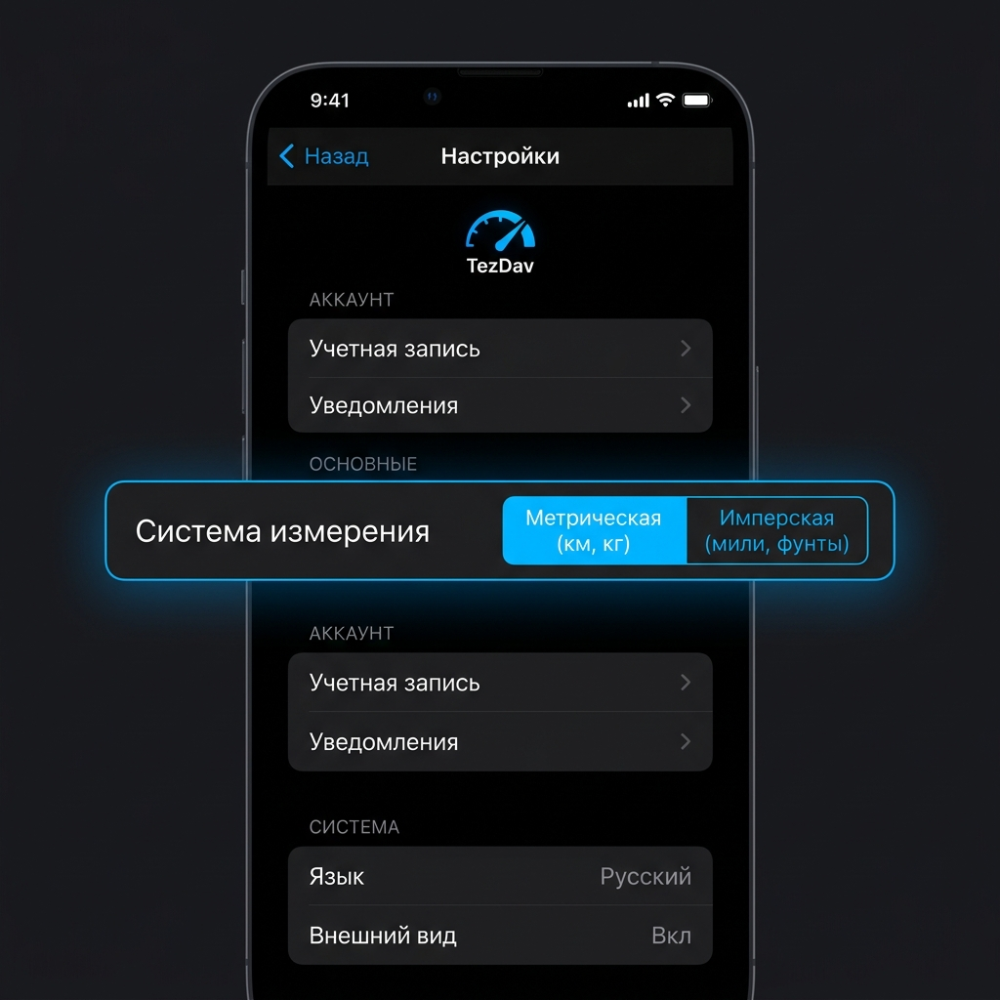
    </td>
    <td width="50%">
      
<b>Анализ активности (Имперские единицы)</b>

      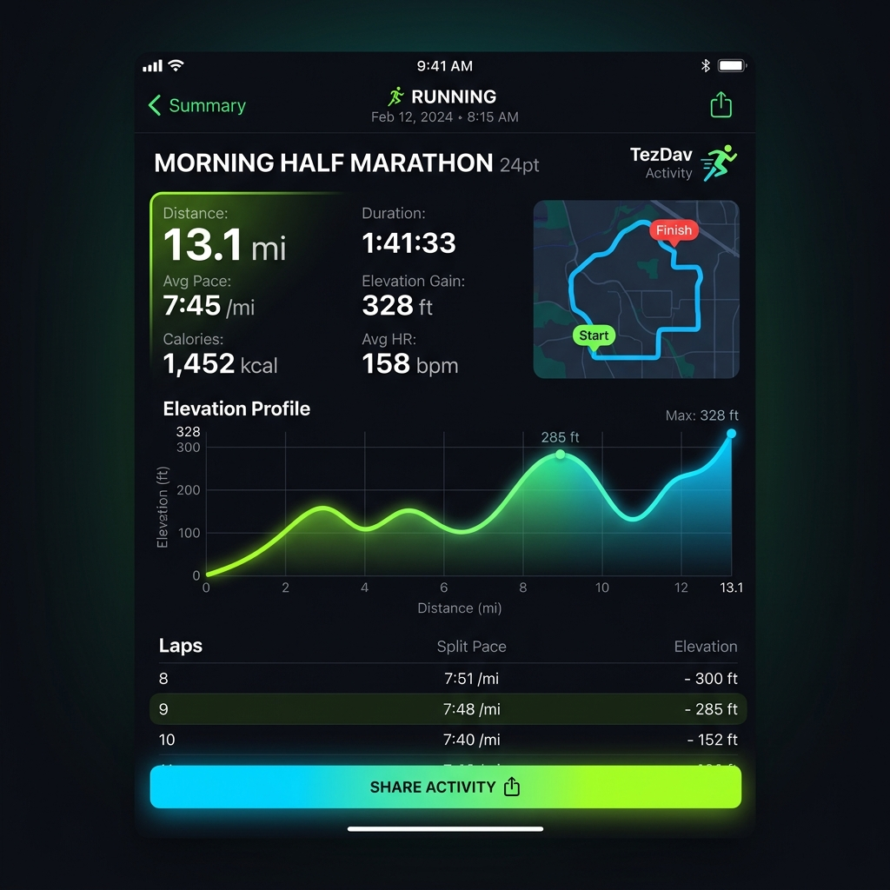
    </td>
  </tr>
  <tr>
    <td width="50%">
      
<b>Индекс готовности к нагрузкам (HRV & Sleep)</b>

      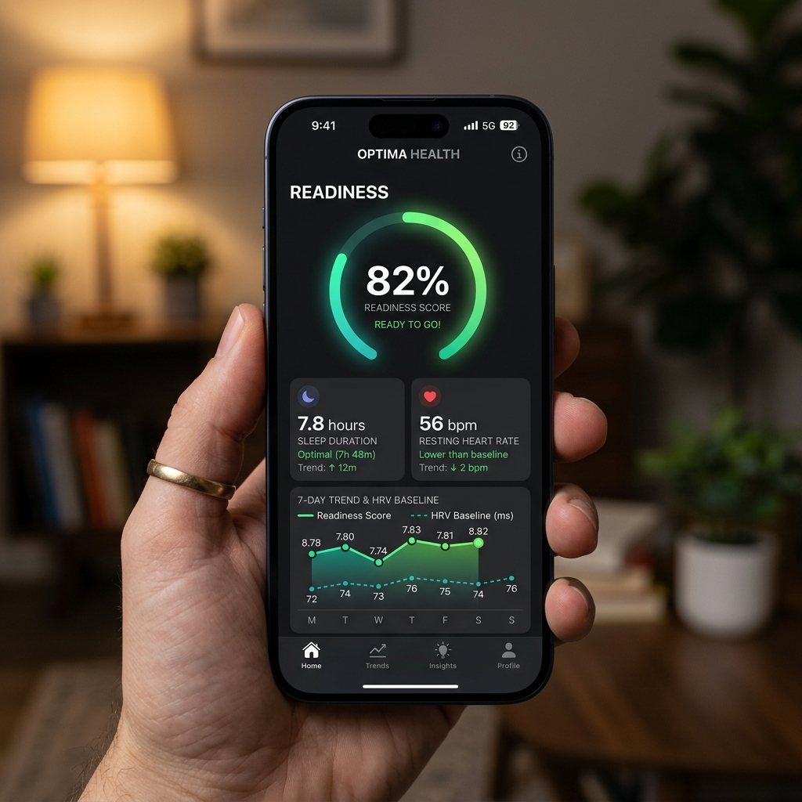
    </td>
    <td width="50%">
      
<b>Беговая динамика (Running Dynamics)</b>

      
    </td>
  </tr>
  <tr>
    <td width="50%">
      
<b>Индивидуальная кривая мощности</b>

      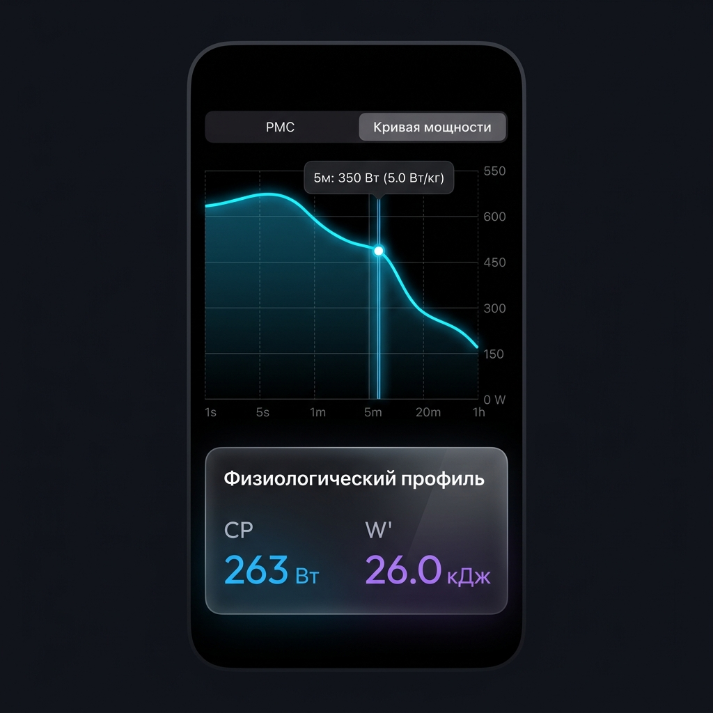
    </td>
    <td width="50%">
      
<b>Зоны мощности Коггана на основе CP</b>

      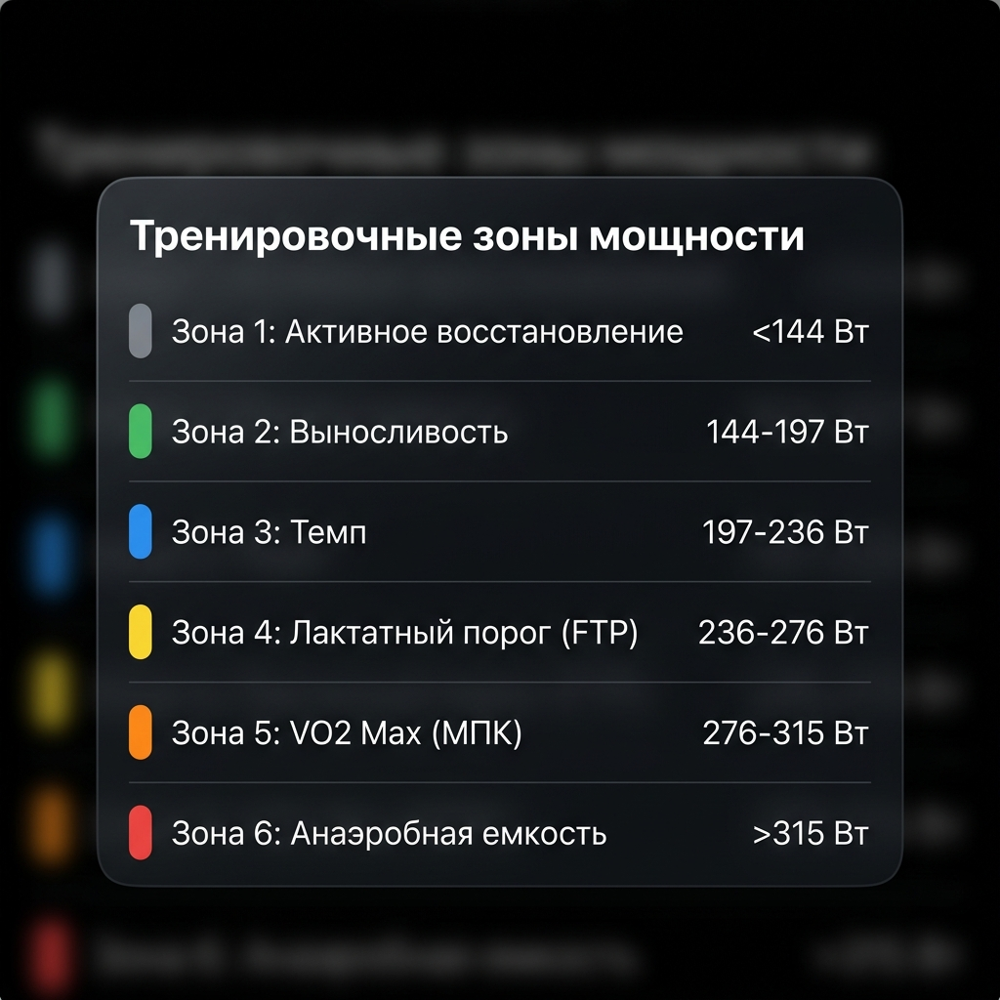
    </td>
  </tr>
  <tr>
    <td width="50%">
      
<b>Сопоставление рекордов мощности с историей</b>

      
    </td>
    <td width="50%">
      
<b>Детали тренировочного сегмента и лидерборд</b>

      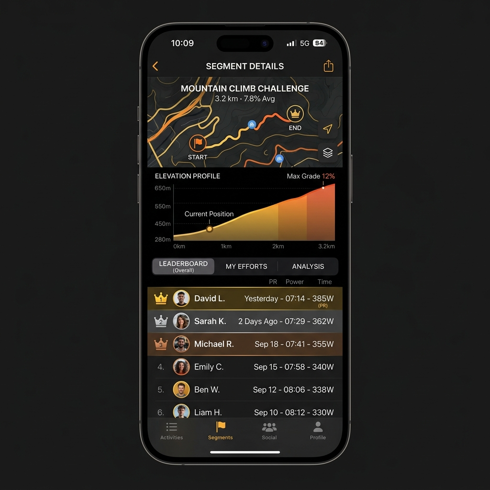
    </td>
  </tr>
  <tr>
    <td width="50%">
      
<b>Учёт износа экипировки (Gear wear tracking)</b>

      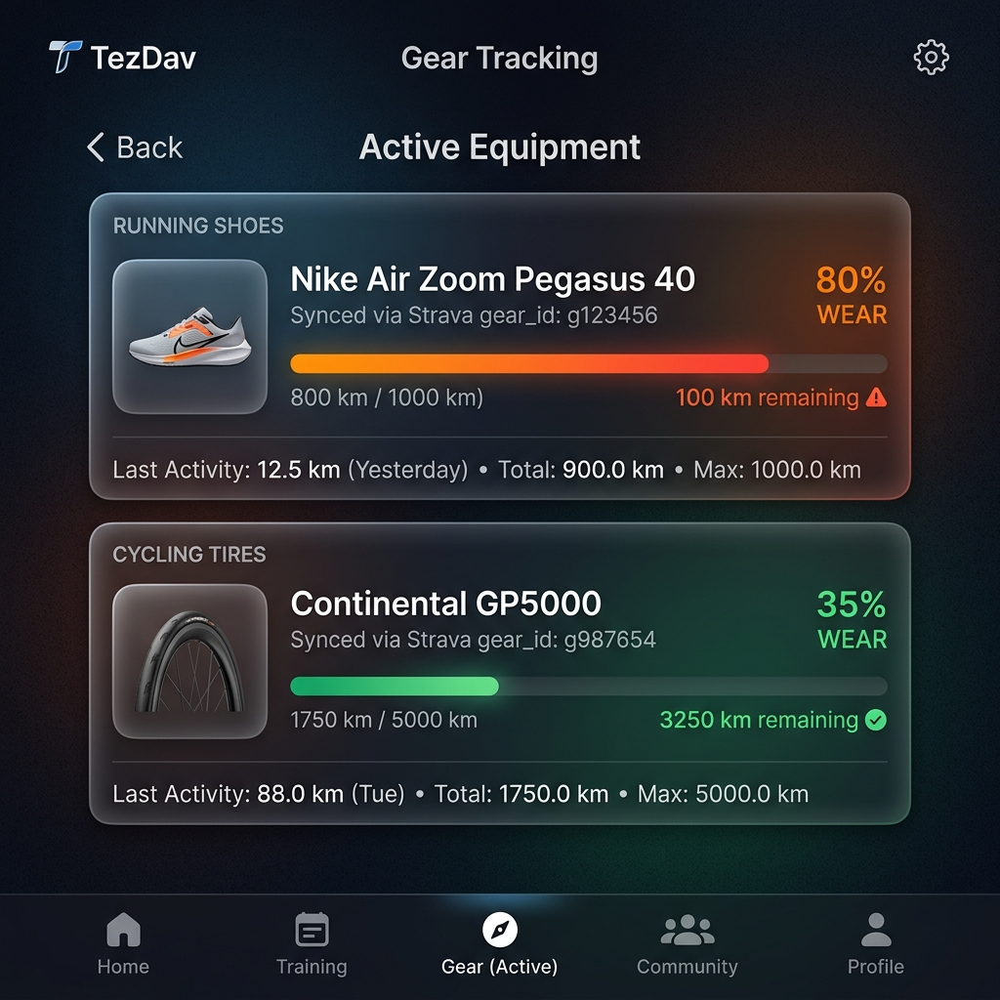
    </td>
    <td width="50%">
      
<b>Аналитика влияния погоды (Weather Correlation)</b>

      
    </td>
  </tr>
  <tr>
    <td width="50%">
      
<b>Персональная тепловая карта (Personal Heatmap)</b>

      
    </td>
    <td width="50%">
      
<b>Ежедневные подсказки ИИ-тренера (Daily AI Coach)</b>

      
    </td>
  </tr>
  <tr>
    <td width="50%">
      
<b>Легкий Casual-режим и достижения</b>

      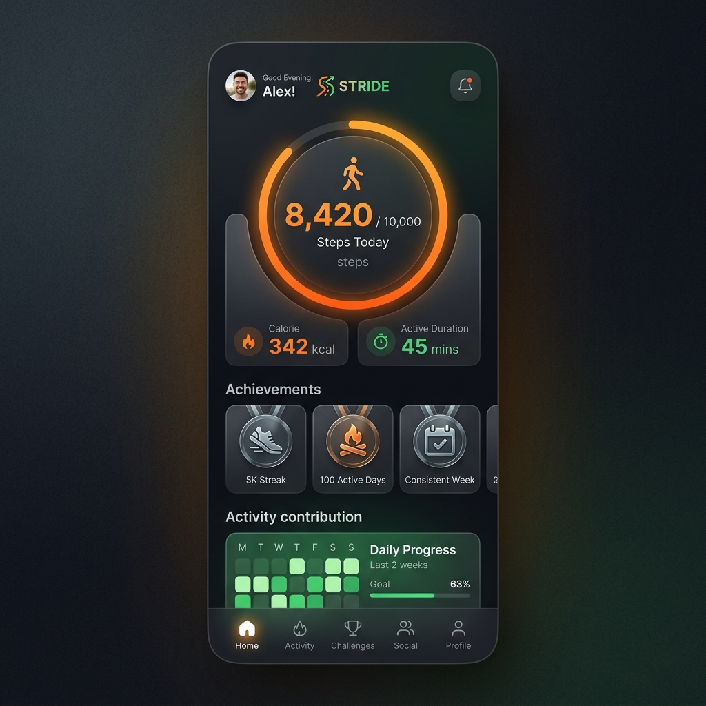
    </td>
    <td width="50%">
      
<b>Красивый шаринг тренировки (Workout Card)</b>

      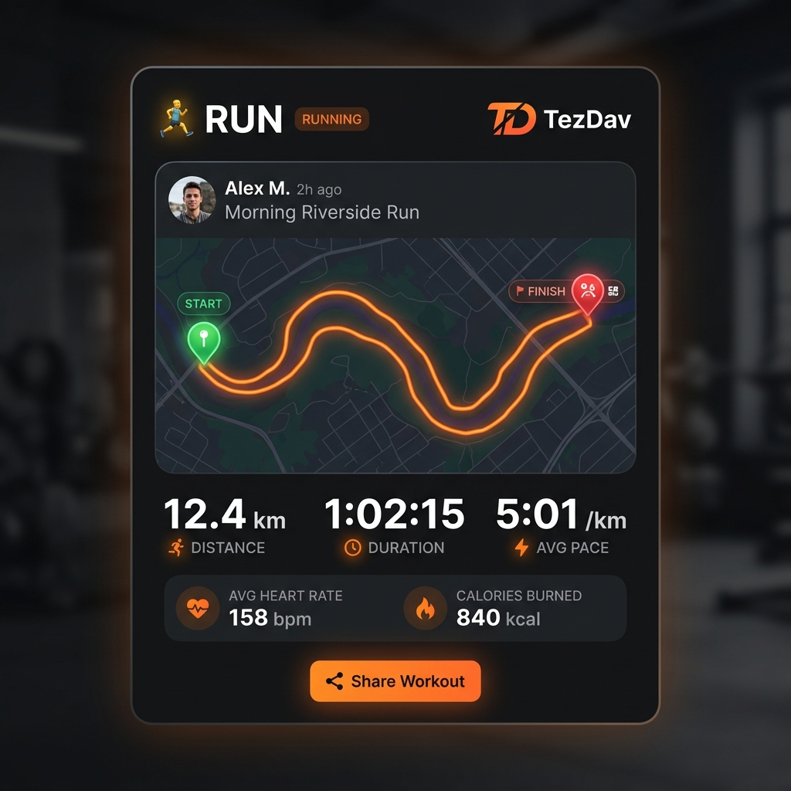
    </td>
  </tr>
  <tr>
    <td width="50%">
      
<b>Сводная карточка за неделю (Weekly Summary)</b>

      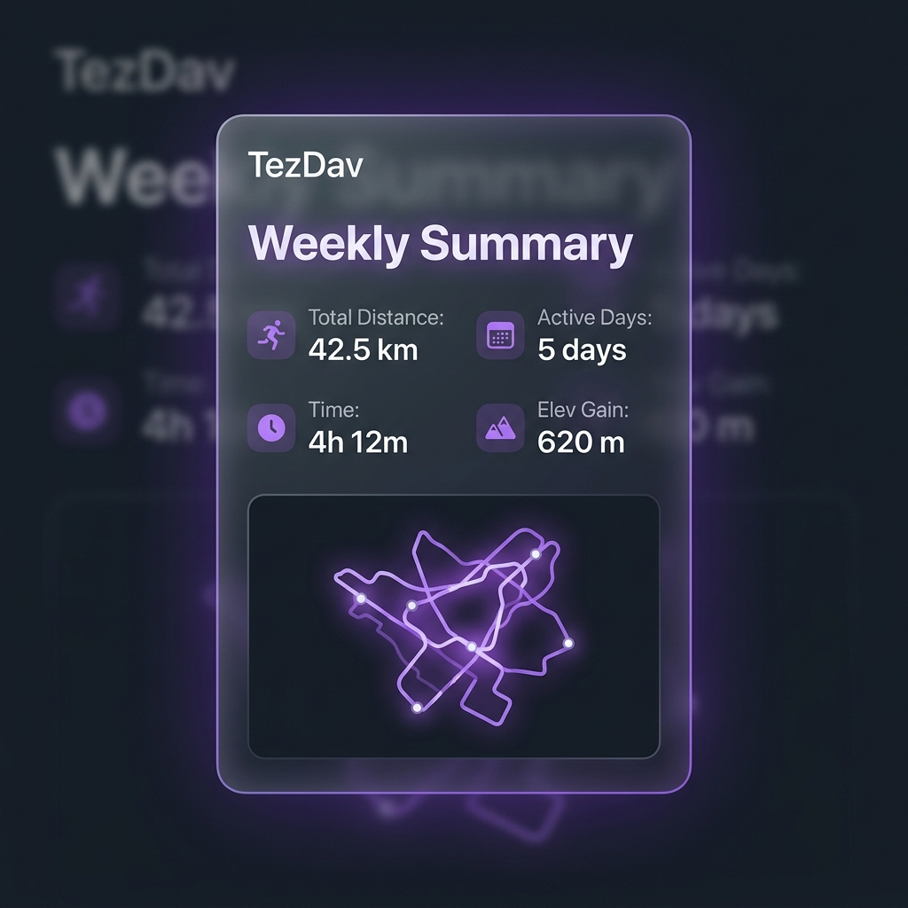
    </td>
    <td width="50%">
    </td>
  </tr>
</table>

---

## 🇬🇧 English Section

**TezDav** is a high-performance training analytics and navigation mobile application tailored for multi-sport athletes (running, cycling, triathlon) in the Apple ecosystem (iPhone and Apple Watch). It aggregates historical metrics, automates cycle planning, builds custom routes, and presents training workloads dynamically.

---

### 🌟 Key Features

* **Live Activities & Dynamic Island**: Real-time tracking displaying timer, distance, current speed/pace, and heart rate with zone color-coding.
* **Interactive Route Builder**: Tap-to-create routes with automatic road-snapping (MKDirections API), elevation profiles (Open-Elevation API integration), estimated duration modeling, and watch synchronization.
* **Power Curve & Critical Power Solver**: Professional cycling analytics featuring Mean Maximal Power (MMP) windows, hyperbolic regression calculations for Critical Power (CP) and anaerobic capacity (W'), and Coggan's power zones.
* **Apple Health (HealthKit) Integration**: Dual synchronization reading activities, sleep analyses, and Heart Rate Variability (HRV) metrics to evaluate daily Readiness Scores.
* **Structured Training Planner**: Dynamic training schedule generator adapting blocks into recovery, developmental, and tapering cycles based on historical workloads.
* **Unified Imperial/Metric Engine**: Global system conversion instantly formatting inputs, charts, and values. Automatically splits running/cycling intervals into 1-mile laps with pace and elevation gains formatted dynamically (mi, ft, lbs, mph, W/lbs).
* **Segments & Leaderboards**: Local offline snapping of activities (GPX/FIT) with predefined segments using the Haversine formula (25m proximity, 15% distance tolerance). Tracks Personal Records (PRs), shows interactive segment maps, Swift Charts elevation profiles, and lists local leaderboards populated with simulated bots.
* **Personal Heatmap**: High-fidelity overlay showing all historical GPS tracks on a single interactive map. Features filtering by sport type, map styles (Standard, Satellite, Hybrid), adjustable line thickness, line opacity (glowing effect), and color scheme presets (Orange, Neon Green, Ice Blue, Multisport). Implements automatic path downsampling and encoding/caching in SwiftData for instant offline loads. Supports exporting high-resolution heatmap images (MKMapSnapshotter + CoreGraphics) via standard Share Sheets.
* **Running Dynamics**: Professional running biomechanics telemetry tracking cadence, vertical oscillation, ground contact time (GCT), L/R balance, and stride length. Visualizes efficiency zones using standard Garmin colors (purple, green, orange, red) and features interactive Swift Charts with tooltips for telemetry analytics over session distance.
* **Local AI Coach & Daily Insights**: On-device recommendation engine parsing Readiness Score, weekly training stress balance (TSB), cadence zones, and gear lifespan. Generates prioritized, highly-tailored coaching recommendations (Safety > Recovery > Gear > Progress > Technique) and maintains a 30-day coaching history archive.
* **Gear Wear & Equipment Lifespan Tracking**: In-depth tracker for running shoes and cycling equipment. Features automatic Strava `gear_id` activity mapping, sport-specific default items, dynamic battery-style colored wear indicators (green/yellow/red) in the user Profile, and instant system alerts when remaining equipment lifespan falls below 50 km.
* **Weather Correlation & Environmental Analytics**: Instant background fetching of historical weather snapshots (temperature, relative humidity, wind speed, WMO codes) at workout start coordinates via Open-Meteo API. Renders Swift Charts scatter plots correlating Speed vs Temperature/Humidity to determine the athlete's optimal training environments, backed by a robust offline mock simulator fallback.
* **Casual Mode, Achievements & Gamification**: Lightweight app mode tailored for daily walking and light activity. Tracks daily steps, active minutes, and calories, coupled with a GitHub-style Activity Contribution Heatmap. Rewards performance with a personal Achievements Showcase featuring streak awards and distance milestones.
* **Workout Card Sharing & Weekly Summary Cards**: Generates high-fidelity visual cards for social media sharing. Supports 1:1 Square and 9:16 Stories formats, customizable styling themes (Dark, Light, Gradient), high-resolution route track map rendering, and weekly activity recap cards with multi-run visual clusters.
* **Personal Geography & Exploring Stats**: In-depth geographical analysis automatically clustering visited cities and neighborhoods. Computes total explored land area on a 1x1 km virtual grid and identifies spatial extrema (northernmost, southernmost, easternmost, and westernmost GPS coordinates of your workouts).
* **Social Feed & Kudos**: Interactive feed of friends' workouts with MapKit route overlays, thumbs-up Kudos interactions (featuring single-tap toggle and double-tap pop-up animation with haptics), and expandable, interactive comment sections. Fully persisted using SwiftData and populated with mock Tajikistan running/cycling seed data.

