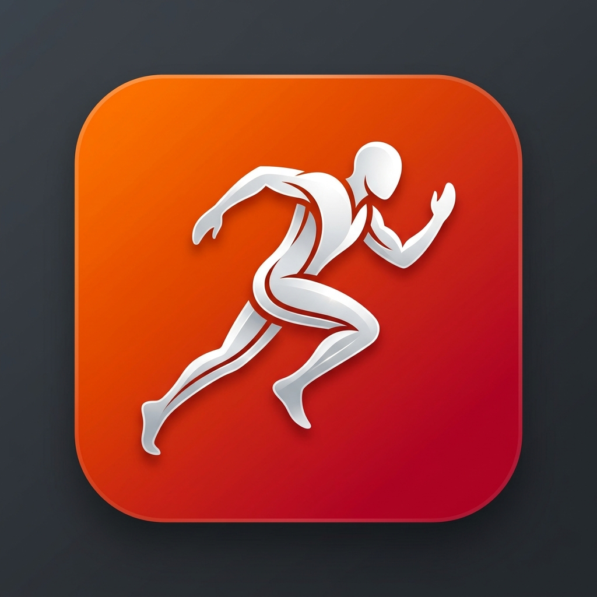
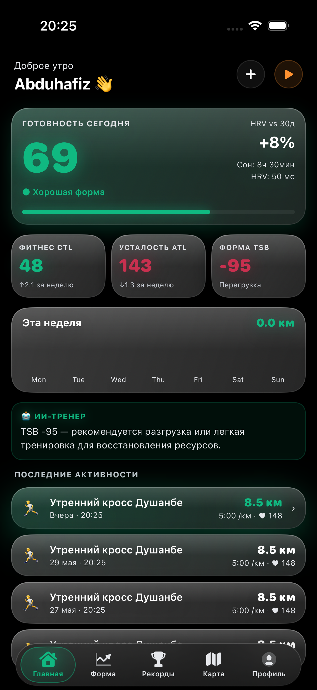
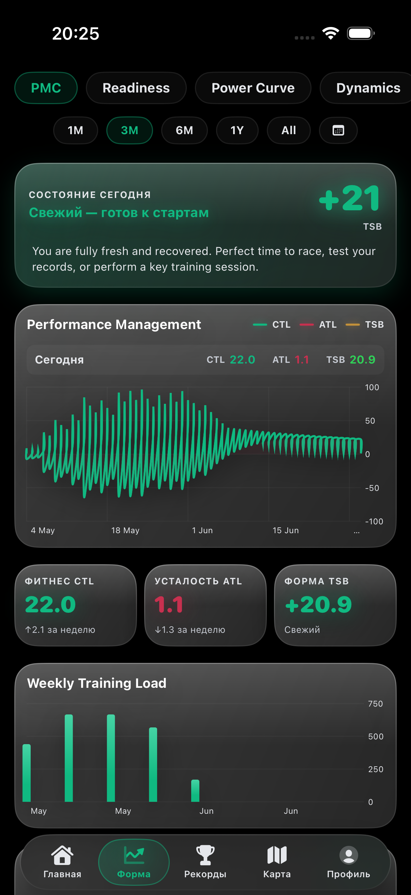
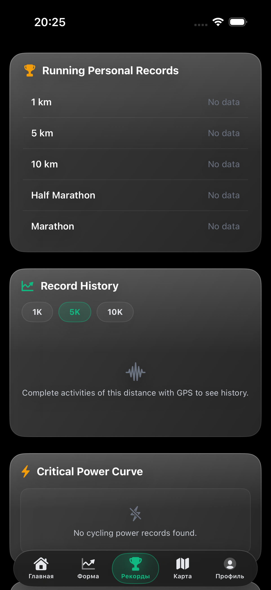
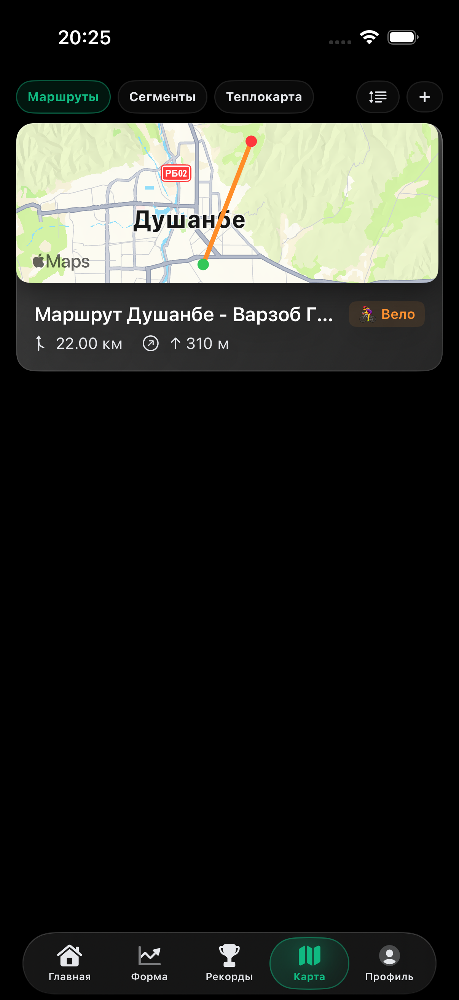
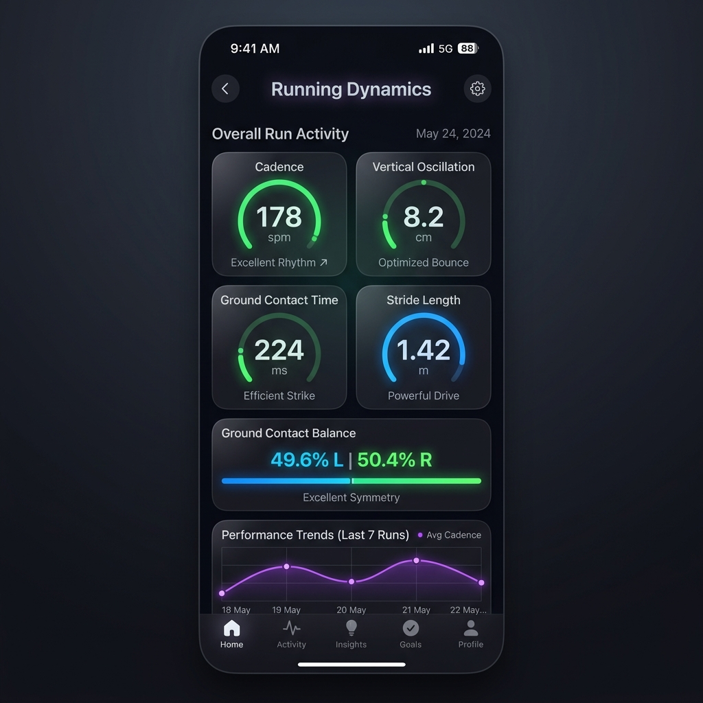
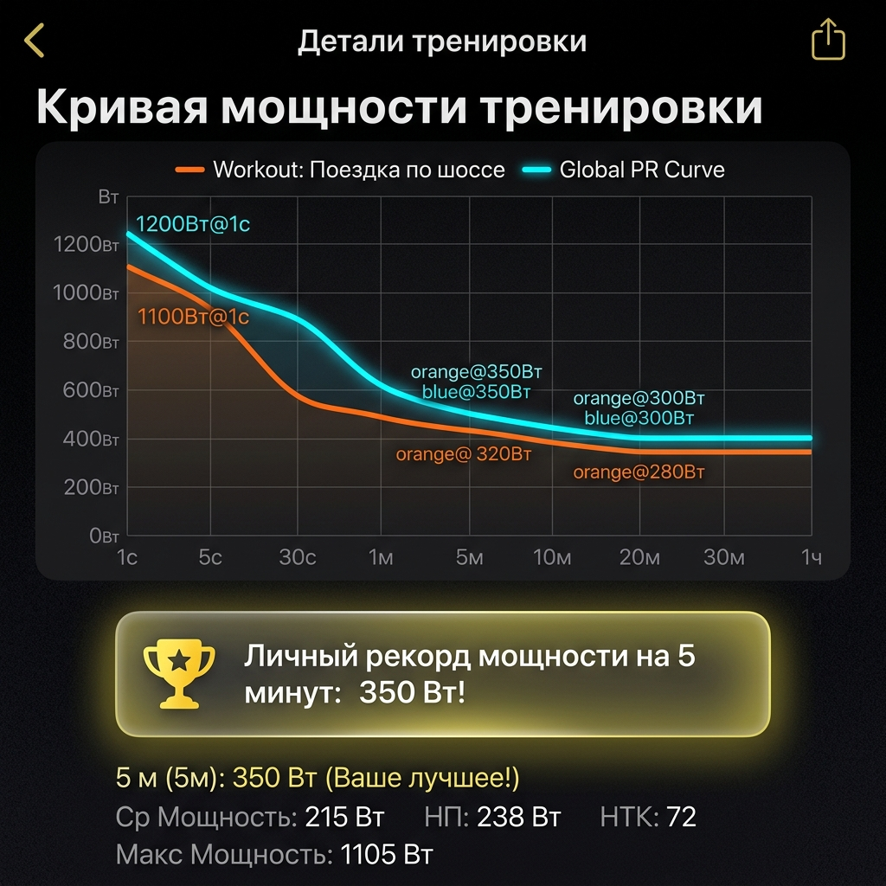
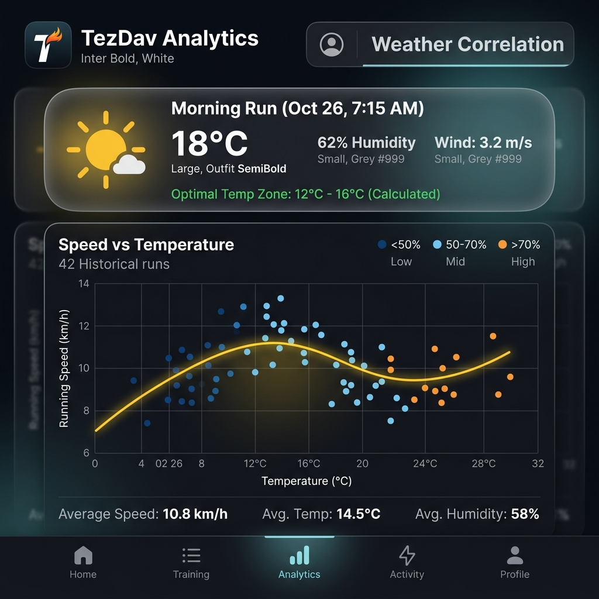
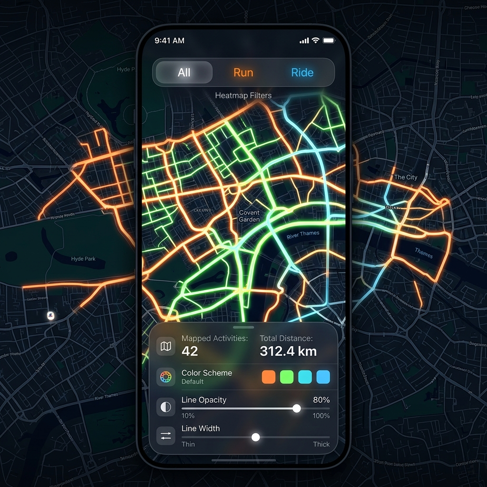

# TezDav 🏃‍♂️🚴‍♀️

<p align="center">
  
</p>

<p align="center">
  <a href="https://developer.apple.com/swift/"></a>
  <a href="https://developer.apple.com/ios/"></a>
  <a href="https://developer.apple.com/watchos/"></a>
  <a href="https://developer.apple.com/xcode/swiftdata/"></a>
  <a href="https://developer.apple.com/maps/"></a>
  <a href="https://developer.apple.com/widgets/"></a>
</p>

<p align="center">
  <strong>TezDav</strong> — продвинутая платформа тренировочной аналитики для мультиспортсменов.<br>
  Весь профессиональный анализ, который сервисы прячут за подпиской — бесплатно, конфиденциально, офлайн.
</p>

---

## 🇷🇺 Русский раздел

### 🎨 Liquid Glass дизайн-система

TezDav использует современную дизайн-систему в духе iOS 26 / macOS Tahoe:

- **Floating glass карточки** — полупрозрачные слои с frosted material и эффектом глубины
- **Изумрудный акцент** (`#10B981`) — фирменный цвет TezDav, отличающий его от Strava
- **Floating Tab Bar** — плавающая капсула с glass-эффектом вместо стандартного tab bar
- **Гибридная реализация**: iOS 26+ — нативный `glassEffect()`; iOS 17–25 — quality fallback

Технические детали дизайна: [DESIGN_SPEC.md](DESIGN_SPEC.md)

---

### 📸 Скриншоты интерфейса

<table>
  <tr>
    <td align="center">
      <b>Dashboard — PMC & Готовность</b><br>
      
    </td>
    <td align="center">
      <b>Форма — CTL/ATL/TSB Performance Management</b><br>
      
    </td>
  </tr>
  <tr>
    <td align="center">
      <b>Рекорды & Кривая мощности</b><br>
      
    </td>
    <td align="center">
      <b>Карта маршрутов</b><br>
      
    </td>
  </tr>
  <tr>
    <td align="center">
      <b>Беговая динамика</b><br>
      
    </td>
    <td align="center">
      <b>Аналитика тренировки & кривая мощности</b><br>
      
    </td>
  </tr>
  <tr>
    <td align="center">
      <b>Аналитика погоды</b><br>
      
    </td>
    <td align="center">
      <b>Персональная тепловая карта</b><br>
      
    </td>
  </tr>
</table>

---

### 🌟 Ключевые возможности

#### 🏃 Тренировочная аналитика
- **PMC / Performance Management Chart** — CTL (фитнес), ATL (усталость), TSB (форма) в реальном времени с прогнозом на 30+ дней
- **Кривая мощности & Critical Power** — Mean Maximal Power (MMP), регрессия CP + W', 6 зон Коггана
- **Беговая динамика** — каденс, вертикальные колебания, GCT, баланс ног, длина шага (зоны Garmin)
- **Индекс готовности (Readiness Score)** — HRV + сон + TSB в единую метрику
- **Прогнозирование результатов** — алгоритм Riegel v2 с поправками на температуру и рельеф

#### 🗺 Карты и маршруты
- **MapKit** — нативная интерактивная карта с маршрутами, точками и цветными треками
- **Интерактивный редактор маршрутов** — клик-для-создания с привязкой к дорогам (MKDirections), профилем высот, экспортом GPX
- **Персональная тепловая карта** — все треки на одной карте с фильтрацией по спорту, цветовыми схемами и экспортом в HD
- **Live Segments** — ведение в реальном времени по личным сегментам с отображением дельты времени

#### 💪 Планирование и прогнозирование
- **TrainingPeaks Forecast** — моделирование CTL/ATL/TSB в будущее, умный TSS-калькулятор по IF-пресетам
- **Структурированный планировщик** — автогенерация макроцикла (базовый, развивающий, восстановительный)
- **ИИ-тренер (on-device)** — персонализированные рекомендации на основе Readiness, TSB, каденса, износа экипировки

#### 🏅 Социальное и геймификация
- **Социальная лента & Kudos** — треки друзей на MapKit, двойной тап с анимацией, комментарии
- **Достижения & Casual-режим** — GitHub-стиль Activity Heatmap, стрики, награды, счётчик шагов
- **Workout Share Cards** — генератор карточек для соцсетей (1:1 и 9:16 Stories, темы оформления)
- **Личная география** — посещённые города, площадь исследованной территории (сетка 1×1 км)

#### ⚙️ Системные интеграции
- **Live Activities & Dynamic Island** — живые метрики на экране блокировки с пульсом и темпом
- **HealthKit** — двусторонняя синхронизация: чтение HRV/сна, запись тренировок
- **Apple Watch App** — нативное приложение с передачей маршрутов через WatchConnectivity
- **Strava OAuth** — автоматический импорт тренировок, GPX/FIT парсер
- **Учёт экипировки** — пробег обуви и велосипеда, индикаторы износа, уведомления
- **Погодная аналитика** — Open-Meteo API, корреляция скорости с температурой и влажностью
- **Сегменты & Лидерборды** — Haversine-matching GPX/FIT с PR-трекером и виртуальными соперниками

---

### 🛠 Стек технологий

| Слой | Технологии |
|------|-----------|
| **UI** | SwiftUI, Swift Charts, MapKit |
| **База данных** | SwiftData (только локально) |
| **Системные расширения** | WidgetKit, ActivityKit (Live Activities), WatchConnectivity |
| **Здоровье** | HealthKit (HRV, сон, шаги, калории) |
| **Геолокация** | CoreLocation, MapKit, MKDirections |
| **Вычисления** | Accelerate (CP regression), Foundation |
| **Сеть** | Strava OAuth 2.0, Open-Meteo API, URLSession |
| **Хранение** | Keychain (токены), AppGroup (Live Activities), CoreSpotlight |
| **Тестирование** | XCTest, Swift Testing, Snapshot Testing |

---

### 🧠 Архитектура проекта

```mermaid
graph TD
    App[TezDav App]

    UI[SwiftUI Views]
    App --> UI
    UI --> Dash[Dashboard & PMC]
    UI --> Detail[Activity Detail & Power Curve]
    UI --> Form[Form/Fitness PMC]
    UI --> Routes[MapKit & Route Builder]
    UI --> Heatmap[Personal Heatmap]
    UI --> Social[Social Feed & Kudos]
    UI --> Coach[AI Coach & Training Planner]
    UI --> Records[Records & Segments]
    UI --> Profile[Profile & Settings]

    Engines[Analytics Engines]
    App --> Engines
    Engines --> TRIMP[TRIMP & TSS Calculator]
    Engines --> CP[Critical Power & W' Solver]
    Engines --> RP[Riegel Race Predictor v2]
    Engines --> RD[Running Dynamics Engine]
    Engines --> Read[HRV & Readiness Score]
    Engines --> AICoach[AI Coach Rules Engine]
    Engines --> Weather[Weather Correlation]

    Ext[System Integrations]
    App --> Ext
    Ext --> LA[Live Activities & Dynamic Island]
    Ext --> HK[HealthKit Dual Sync]
    Ext --> WC[WatchConnectivity]
    Ext --> Widget[iOS Widget & Watch App]
    Ext --> Maps[MapKit]
    Ext --> Strava[Strava OAuth & Sync]

    DB[(SwiftData Local)]
    App --> DB
```



---

### 🚀 Установка и запуск

#### Требования
- Xcode 16.0+
- iOS 17.0+ (симулятор или устройство)
- Apple Developer signing для запуска HealthKit на физическом устройстве

#### Конфигурация
1. Клонируй репозиторий:
   ```bash
   git clone https://github.com/Hafiz0ff/TezDav.git
   cd TezDav
   ```

2. Открой проект:
   ```bash
   open TezDav.xcodeproj
   ```

3. Для запуска на устройстве выбери свою команду подписи и проверь возможности
   **HealthKit**, **Background Delivery** и **App Groups**.

4. В Xcode выбери схему **TezDav** и запусти на симуляторе или устройстве. Карты
   работают через встроенный MapKit и не требуют API-ключа.

> **Демо-режим**: При первом запуске на симуляторе без данных, приложение автоматически заполняется реалистичными тренировочными данными из Душанбе, Таджикистан.

---

### 📁 Структура проекта

```
TezDav/
├── AppRootView.swift          # Root view с навигацией и deep links
├── TezDavApp.swift            # App entry point + SwiftData container
├── Components/                # Переиспользуемые UI компоненты
│   ├── CustomTabBar.swift     # Floating glass tab bar
│   ├── ActivityCardView.swift # Карточка активности
│   └── TezDavMapView.swift    # Общий MapKit UIViewRepresentable
├── Dashboard/                 # Основные экраны приложения
│   ├── DashboardView.swift    # Главный экран (PMC, готовность, активности)
│   ├── FormView.swift         # PMC chart, Power Curve, Running Dynamics
│   ├── RecordsView.swift      # Рекорды, сегменты, лидерборды
│   ├── ProfileView.swift      # Настройки, пульсовые зоны, экипировка
│   ├── SocialFeedView.swift   # Лента друзей с Kudos
│   ├── ActivityDetailView.swift # Детальный анализ тренировки
│   └── DemoDataSeeder.swift   # Генератор демо-данных
├── RouteBuilder/              # Карта и построитель маршрутов
│   ├── RouteBuilderView.swift
│   ├── PersonalHeatmapView.swift
│   └── HeatmapMapView.swift
├── TrainingMetrics/           # Спортивно-научные движки
│   ├── TrainingLoadCalculator.swift  # TRIMP, CTL, ATL, TSB
│   ├── AICoachEngine.swift           # ИИ-тренер
│   ├── RacePredictorEngine.swift     # Prognoz Riegel v2
│   ├── RunningDynamicsEngine.swift   # Биомеханика бега
│   └── SegmentMatcher.swift          # Haversine segment matching
├── LiveActivity/              # Dynamic Island & Lock Screen
├── DesignSystem/              # Цвета, стили, LiquidGlass
└── Persistence/               # SwiftData models
```

---

## 🇬🇧 English Section

**TezDav** is a high-performance training analytics and navigation app for multi-sport athletes (running, cycling, triathlon) built for the Apple ecosystem (iPhone + Apple Watch). All the professional analytics that paid services hide behind paywalls — free, private, and offline.

### 🌟 Key Features

- **PMC / Performance Management Chart** — Real-time CTL, ATL, TSB with 30-day forecast
- **Power Curve & Critical Power Solver** — MMP windows, hyperbolic CP + W' regression, Coggan zones
- **MapKit Integration** — Native maps with route overlays, waypoints, and a route builder
- **Live Activities & Dynamic Island** — Real-time pace, HR, distance on Lock Screen
- **Running Dynamics** — Cadence, GCT, vertical oscillation, L/R balance (Garmin color zones)
- **AI Coach (on-device)** — Readiness + TSB + cadence + gear-based daily coaching
- **TrainingPeaks Forecast** — Future CTL/ATL/TSB modeling, smart TSS calculator
- **Personal Heatmap** — All GPS tracks on one map with export to HD image
- **Segments & Leaderboards** — Haversine matching, PR tracking, virtual competitors
- **Social Feed & Kudos** — Friends' workouts with MapKit overlays, double-tap kudos
- **Strava OAuth Sync** — Automatic activity import with GPX/FIT parser
- **HealthKit** — HRV, sleep, steps bidirectional sync
- **Apple Watch App** — Native watchOS app with WatchConnectivity route sync
- **Gear Wear Tracking** — Shoe/bike lifespan tracking with battery-style indicators
- **Weather Correlation** — Open-Meteo API, speed vs temperature/humidity charts

### Tech Stack

SwiftUI · SwiftData · Swift Charts · MapKit · HealthKit · WidgetKit · ActivityKit · CoreLocation · WatchConnectivity · Strava OAuth 2.0 · Open-Meteo API

### Requirements

- Xcode 16.0+
- iOS 17.0+ / watchOS 10.0+
- Apple Developer signing for HealthKit on a physical device
